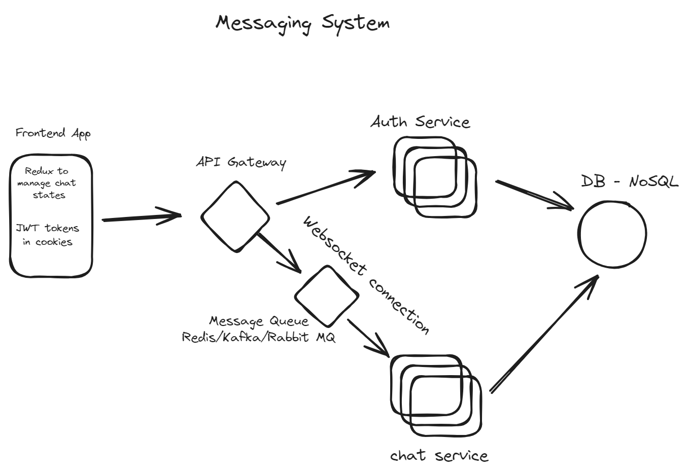

# Messaging System
Designing a high-level system for a messaging platform that is highly available and fault-tolerant involves considering various components and their interactions. Below is an outline of the system design:

## Requirements
### Functional Requirements:

* User registration and authentication
* Sending and receiving messages
* Message storage and retrieval
* Real-time message delivery
* Offline message handling

### Non-Functional Requirements:

* High availability (minimal downtime)
* Fault tolerance (resilience to failures)
* Scalability (handling increasing number of users and messages)
* Low latency (fast message delivery)
* Consistency (eventual consistency for messages)

